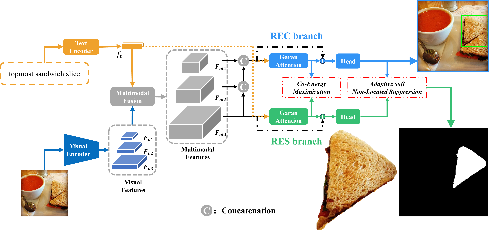
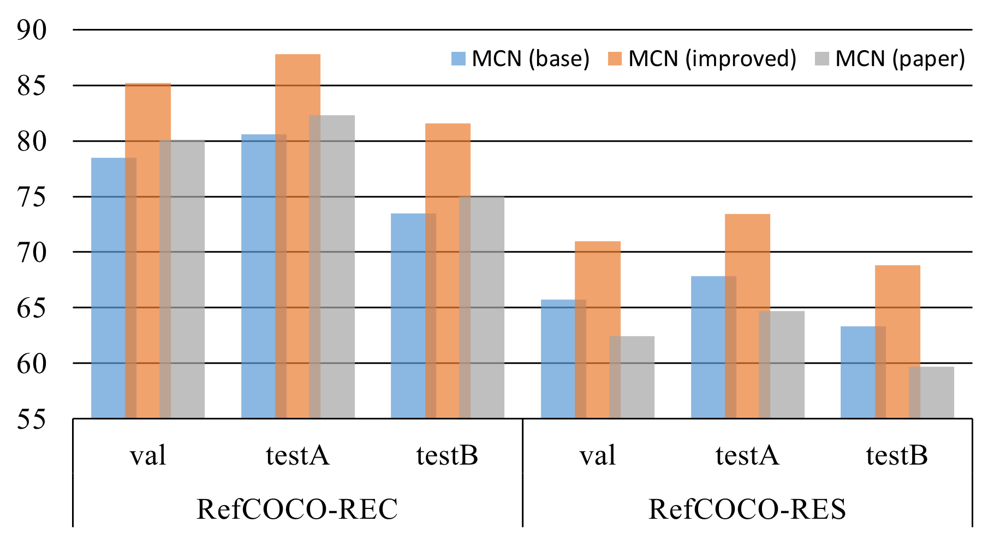

# 改进 MCN

[Multi-task Collaborative Network for Joint Referring Expression Comprehension and Segmentation](https://openaccess.thecvf.com/content_CVPR_2020/papers/Luo_Multi-Task_Collaborative_Network_for_Joint_Referring_Expression_Comprehension_and_Segmentation_CVPR_2020_paper.pdf) 论文发表于CVPR-2020，论文中首次提出将指称表达理解和指称表达分割两个任务结合联系起来，在一个统一的**MCN**模型中的进行协同训练，使两个任务之间起到“相互补充”的效果。


<p align="center">
	
</p>

本仓库在原开源代码的基础上，参考相关领域论文和代码框架，对**MCN**进行改进。在RefCOCO val、testA和testB上的实验结果表明，改进后的模型相比原论文有显著提升。在REC任务上分别提升5.14%、5.50% 和5.61%，在RES任务上分别提升8.54%、8.75% 和 9.13%

<p align="center">
	
</p>


## 训练和测试

<!-- 1. Prepare your settings. To train a model, you should  modify ``./config/config.yaml``  to adjust the settings  you want. 
2. Train the model. run ` train.py`  under the main folder to start training:
```
python train.py --config ./config/config.yaml
```
3. Test the model.   Then, you can run ` test.py`  by
```
python test.py --eval-weights ./logs/simrec/1/weights/det_best.pth
```
4. Training log.  Logs are stored in ``./logs`` directory, which records the detailed training curve and accuracy per epoch. If you want to log the visualizations, please  set  ``LOG_IMAGE`` to ``True`` in ``config.yaml``.    -->

1. **训练模型**
```shell
OMP_NUM_THREADS=1 CUDA_VISIBLE_DEVICES=0 PORT=23450 bash tools/train.sh configs/mcn_refcoco_scratch_yolov8x_fusion3_multiscale_ema_anchorfree.py 1
```

2. **测试模型**
```shell
OMP_NUM_THREADS=1 CUDA_VISIBLE_DEVICES=0 PORT=23450 bash tools/eval.sh configs/mcn_refcoco_scratch_yolov8x_fusion3_multiscale_ema_anchorfree.py 1 ./output/mcn_refcoco_scratch_yolov8x_pretrain_freeze-2_cosine_fusion3_multiscale_ema_anchorfree_onegpu_nosyncbn/last_checkpoint.pth
```


## 引用的代码仓库

- [MCN](https://github.com/luogen1996/MCN)
- [SimREC](https://github.com/luogen1996/SimREC)
- [ultralytics](https://github.com/ultralytics/ultralytics)
- [YOLOv8](https://github.com/bubbliiiing/yolov8-pytorch)

